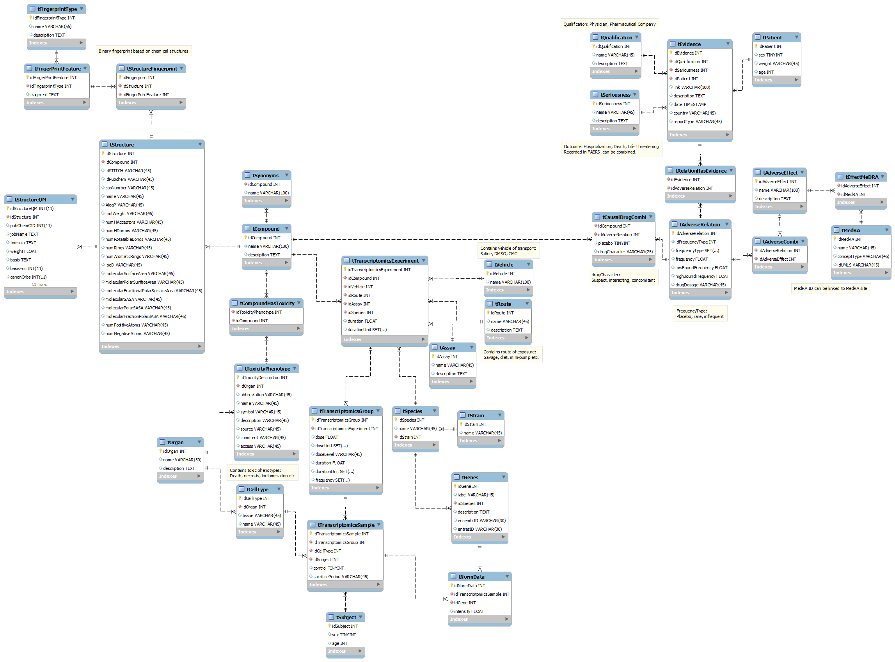

AdverseEffectsPredictor
==========

##Description

This is a database and prediction/analysis algorithm which can be used to store (adverse) side-effect/chemical structure relationships and use this information in the prediction of side-effects in other compounds based on the comparison of binary chemical fingerprints, gene expression omics and related statistics.

##Data used in the prediction/analysis

The following data-sources are used:

-	[SIDER2](http://sideeffects.embl.de/)
	-	Compound-Adverse Effect relationships
-	[TG-Gates](ftp://ftp.biosciencedbc.jp/archive/open-tggates/LATEST/README_e.html)
	-	Compound-Gene-expression relationships
-	[Protect ADR](http://www.imi-protect.eu/adverseDrugReactions.shtml)
	-	Compound-Adverse Effect relationships
-	[ChEMBL](https://www.ebi.ac.uk/chembl/)
	-	Compound-Structure relationships
-	[DIAMONDS](https://www.tno.nl/downloads/diamonds_leaflet.pdf) (TNO In-house DB)
	-	Compound-Structure & Compound-Gene-expression relationships
	
##Initial data files

The compounds as they were available in ChEMBL were used as the reference compounds on which the adverse effects were linked, see /sql/fillCompounds for these compounds. (As these contain SMILES and identifiers from other databases)

These are the files that were used for the creation of the initial DB, read by the scripts in /writeData2DB/
-	ChEMBL
	-	The MySQL version was downloaded and relevant information to the compounds was extracted and used in our own database.
-	SIDER2	
	-	*(17-10-2012)*
		-	meddra_adverse_effects.tsv
		-	meddra_freq_parsed.tsv
-	TG-GATEs
	-	All data from the files were converted into an MySQL schema, linked on the compounds provided by ChEMBL.
-	PROTECT ADR
	-	Final repository_version published on PROTECT eRoom 23 Sep 2013_DLP 31 Dec 2012
	
##Predictors used
The binary fingerprints which are deduced from the compounds and used in the prediction of side-effects are the following:
- Chemical groups
- logP  (Partition coefficient)
- Molecular mass
- Protein targets
- Metabolite forming
- Quantum mechanics

Gene expression data (Omics) is also used as an additional resource in the prediction.

##Installation/setup

-	Dependencies:
	-	For writing the initial data-files to the DB
		-	Python 3.4, PyMySQL, optparse, MySQL ≥ 5.6
	-	AdversePredictor
		-	R, optparse, MySQL ≥ 5.6
		-	*(Additional required packages will be automatically installed)*
	
##Examples

Example data can be found in the /examples/ folder.

##Impressions

###Impression interface

**Insert impression here**

###Impression data-output

**Insert impression data-output here**

##Flowcharts 

**Insert flowcharts here**

##ERD

